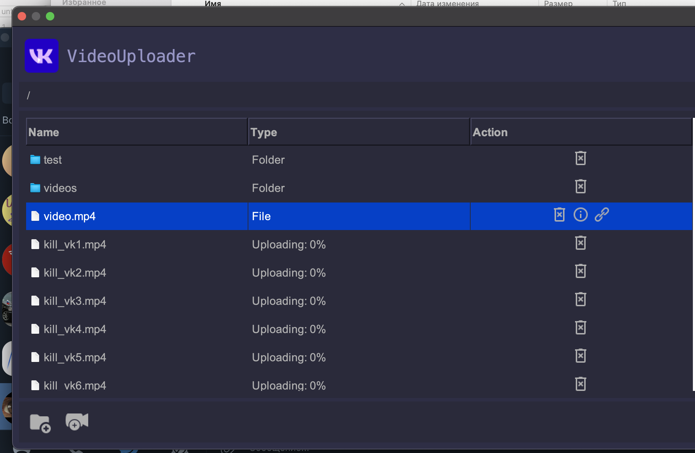

# VK VideoUploader

**VK VideoUploader** – удобная утилита для быстрой загрузки видеороликов в группы **ВКонтакте** с возможностью организации видеофайлов в виде **виртуальной файловой системы**. Программа поддерживает **Windows, MacOS и Linux** (архитектуры **arm64, x86/x64**) и обеспечивает надежную работу даже при нестабильном подключении к интернету.



## 🔹 Преимущества VK VideoUploader

✅ **Гибкая организация видео**  
- Создавайте **папки и подпапки**, структурируя файлы по аналогии с привычной файловой системой.
- Используется система альбомов **(название альбома = "папка/подпапка1/подпапка2...")**, что делает управление видео максимально удобным.

✅ **Параллельная загрузка**  
- Одновременно загружайте **множество видео**, не дожидаясь завершения предыдущих файлов.

✅ **Автоматическое возобновление загрузки**  
- В случае **обрыва соединения** или других неполадок, пройсходит автоматический перезапуск загрузки, обеспечивая **стабильность и надежность** процесса.

✅ **Интуитивно понятный интерфейс**  
- Приятный **графический интерфейс** в стиле стандартного файлового менеджера **ПК**.
- **Отображение статуса загрузки** в реальном времени, чтобы вы всегда были в курсе прогресса.

---
🎥 **VK VideoUploader** — удобный инструмент для блогеров, администраторов сообществ и всех, кто регулярно загружает видео в **ВКонтакте**. 🔥


## Установка (Без GUI)

### 1. Установите Docker
Убедитесь, что Docker установлен на вашем компьютере. Если Docker не установлен, следуйте официальной инструкции:
- [Установка Docker для Windows](https://docs.docker.com/desktop/windows/install/)
- [Установка Docker для macOS](https://docs.docker.com/desktop/mac/install/)
- [Установка Docker для Linux](https://docs.docker.com/engine/install/)

### 2. Запустите контейнер

### 🔧 Запуск в консольном режиме

Для запуска приложения в консольном режиме выполните следующую команду:

```bash
docker run -it -v "ДОМАШНЯЯ_ДИРЕКТОРИЯ":/root krut74891/vk-video-uploader:latest
```

**Важно:** В параметре `-v` укажите путь к рабочей папке, где хранятся видео для загрузки. Путь к директории может отличаться в зависимости от операционной системы.

Пример для различных ОС:
- **Windows**: `-v "C:/Users/Stanislav/Documents":/root`
- **MacOS/Linux**: `-v "/home/user/videos":/root`

### 🛠 Обязательные параметры:
При запуске необходимо указать токен и ID группы.

| Параметр       | Описание |
|---------------|----------|
| TOKEN         | Вставьте сюда ссылку целиком из адресной строки после авторизации на [этой странице](https://oauth.vk.com/authorize?client_id=52502099&display=page&redirect_uri=https://oauth.vk.com/blank.html&scope=friends,video,group,offlines&response_type=token&v=5.59). |
| GROUP      | Укажите числовой ID вашей группы ВКонтакте. (Можно получить на [этом сайте](https://regvk.com/id/)) |

**Готово! Если вы указали все параметры, утилита должна запуститься.**

### 🎨 Запуск с графическим интерфейсом (GUI)

Графический интерфейс работает на базе noVNC, в котором часто имеются проблемы с буфером обмена, поэтому рекомендуем прямо в команде указать токен и айди группы.


```bash
docker run -p 6080:6080 -v "ДОМАШНЯЯ_ДИРЕКТОРИЯ":/root -e GUI=true -e TOKEN="" -e GROUP="" krut74891/vk-video-uploader:latest
```

После запуска утилита станет доступна в браузере по адресу `localhost:6080`.

---

### Команды:

- `ls` - показать файлы и подпапки в текущей папке.
- `mkdir <name>` - создать папку.
- `cd <path>` - перейти в папку по указанному пути.
- `rmdir <name>` - удалить папку с её содержимым. ВНИМАНИЕ! Это удалит все видеофайлы в папке и её подпапках!
- `rmfile <name>` - удалить файл в текущей папке.
- `addvideo <path>` - экспортировать видео с локального пути в VK. Может быть папка с файлами или одиночный файл.
- `setcredentials <token> <groupId>` - изменить данные для доступа.
- `exit` - остановить утилиту.
- `sync` - синхронизация с файловой системой VK.

---

### Требования
- Docker
- Веб-браузер (для GUI)
- Свободный порт 6080 (для GUI)
---
## 🚀 Самостоятельная сборка проекта

### 🔧 Требования:
- **Java 11+** (рекомендуется OpenJDK 11 или выше)
- **Maven** (для управления зависимостями)

### 📌 Установка и запуск:
1. **Клонируйте репозиторий**  
   
```bash
git clone https://github.com/your-repository/VK-VideoUploader.git
cd VK-VideoUploader
```

2. **Соберите проект с помощью Maven**  
   
```bash
mvn clean package
```

3. **Запустите приложение**  
   
```bash
java -jar target/VKVideoUploader.jar
```

### 🛠 Разработка и тестирование:
- Исходный код приложения находится в `src/main/java`.
- Основной класс для запуска: `core.ru.sanichik.Main`.
- GUI реализован с использованием **Swing**.
- Логирование можно настроить через `log4j.properties`.

---

### Возможные проблемы и решения

1. Если папки не создаются или видео не выгружаются:
   - Проверьте, правильно ли указан ID группы.
   - Убедитесь, что в настройках группы включены разделы "видео" и "обсуждения".
   - Проверьте, есть ли у вас доступ к группе.
2. Если появляется ошибка "Token is invalid":
   - Получите новый токен VK API.
   - Убедитесь, что VPN отключен.
   - Убедитесь, что провайдер не блокирует доступ к VK API.

